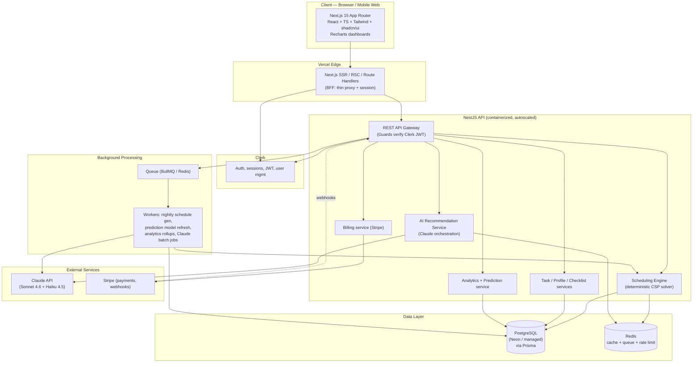
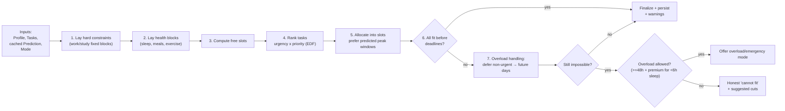
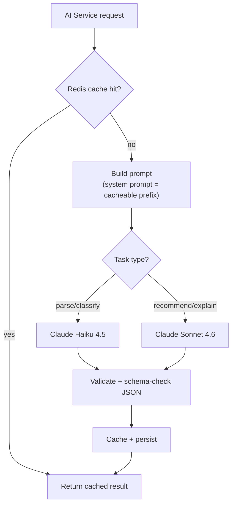
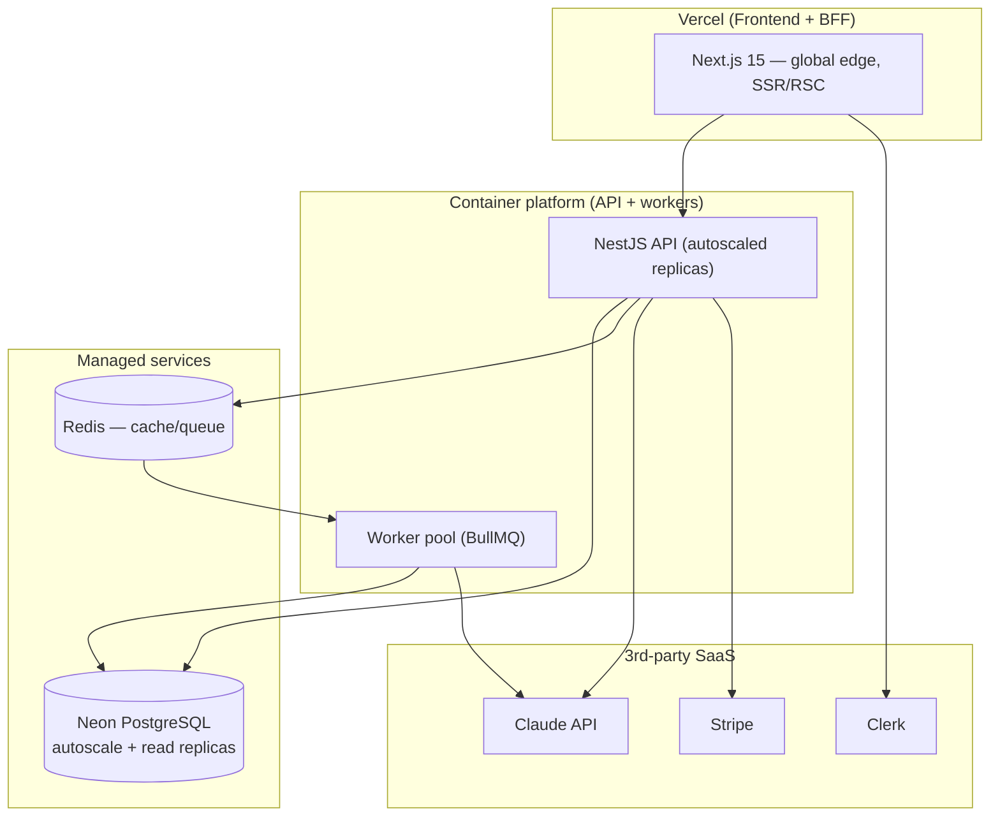

# System Architecture — AI Healthy Scheduler

**Document type:** Technical Architecture & Design
**Author:** Staff Software Architect
**Version:** 1.0
**Status:** For review
**Companion to:** AI Healthy Scheduler PRD v1.0

**Stack summary:** Next.js 15 + React + TypeScript + Tailwind + shadcn/ui (frontend) · NestJS + PostgreSQL + Prisma (backend) · Claude API (intelligence layer) · Clerk (auth) · Stripe (payments) · Recharts (analytics). Target: modern SaaS, scalable to 100k users, AI-powered scheduling, mobile-responsive.

> **Key architectural stance:** Core scheduling is a **deterministic constraint solver running on our own backend** — *not* an LLM call. Claude powers the *intelligence layer* (natural-language task parsing, recommendations, substitution suggestions, explanations). This single decision keeps the product fast, correct, reproducible, and an order of magnitude cheaper than "ask the LLM to plan the day" architectures.

---

## 1. High-Level Architecture Diagram



**Request flow (typical "generate my day"):**
1. Client calls a Next.js route handler (BFF) with the Clerk session.
2. BFF forwards to the NestJS API with the Clerk JWT; a Guard verifies it.
3. The Scheduling Engine pulls profile + tasks + cached prediction from Postgres/Redis and runs the solver (no network/LLM in the hot path).
4. If the user used natural-language input or wants recommendations, the AI Service calls Claude (often async/queued).
5. Result is persisted and returned; dashboards read aggregated analytics.

---

## 2. Database Schema (Prisma)

```prisma
// schema.prisma — PostgreSQL

generator client {
  provider = "prisma-client-js"
}

datasource db {
  provider = "postgresql"
  url      = env("DATABASE_URL")
}

enum SubscriptionTier { FREE PREMIUM }
enum TaskStatus       { PENDING SCHEDULED IN_PROGRESS DONE DEFERRED }
enum Priority         { LOW MEDIUM HIGH }
enum ScheduleMode     { STANDARD OVERLOAD EMERGENCY }
enum ActivityType {
  SLEEP MEAL EXERCISE WORK STUDY
  COOKING ENTERTAINMENT COMMUTE SOCIAL TASK BUFFER
}
enum CompletionStatus { COMPLETED SKIPPED PARTIAL }

model User {
  id              String            @id // mirrors Clerk user id
  email           String            @unique
  timezone        String            @default("UTC")
  locale          String            @default("en")
  subscriptionTier SubscriptionTier @default(FREE)
  createdAt       DateTime          @default(now())
  updatedAt       DateTime          @updatedAt

  profile         UserProfile?
  tasks           Task[]
  schedules       DailySchedule[]
  completions     CompletionLog[]
  overloadEvents  OverloadEvent[]
  predictions     Prediction[]
  productivity    ProductivityProfile[]
  subscription    Subscription?
}

model UserProfile {
  id                String   @id @default(cuid())
  userId            String   @unique
  user              User     @relation(fields: [userId], references: [id], onDelete: Cascade)
  wakeTime          String   // "07:00" local
  sleepTime         String   // "23:00" local
  targetSleepHours  Float    @default(7)
  minSleepHours     Float    @default(6)
  mealTimes         Json     // ["08:00","12:30","19:00"]
  exerciseEnabled   Boolean  @default(true)
  exerciseMinutes   Int      @default(45)
  commuteMinutes    Int      @default(0)
  workBlocks        Json     // [{days:[1..5], start:"09:00", end:"18:00"}]
  optionalActivities Json    // ["cooking","entertainment","social"]
  updatedAt         DateTime @updatedAt
}

model Task {
  id              String     @id @default(cuid())
  userId          String
  user            User       @relation(fields: [userId], references: [id], onDelete: Cascade)
  title           String
  description     String?
  estimatedMinutes Int
  remainingMinutes Int
  deadline        DateTime?
  priority        Priority   @default(MEDIUM)
  status          TaskStatus @default(PENDING)
  isSplittable    Boolean    @default(true)
  createdAt       DateTime   @default(now())
  updatedAt       DateTime   @updatedAt

  blocks          ScheduleBlock[]

  @@index([userId, status])
  @@index([userId, deadline])
}

model DailySchedule {
  id               String        @id @default(cuid())
  userId           String
  user             User          @relation(fields: [userId], references: [id], onDelete: Cascade)
  date             DateTime      @db.Date
  mode             ScheduleMode  @default(STANDARD)
  isOverloaded     Boolean       @default(false)
  totalSleepMinutes Int          @default(0)
  generationMeta   Json?         // {version, inputsHash, predictionId}
  createdAt        DateTime      @default(now())

  blocks           ScheduleBlock[]

  @@unique([userId, date])
  @@index([userId, date])
}

model ScheduleBlock {
  id            String        @id @default(cuid())
  scheduleId    String
  schedule      DailySchedule @relation(fields: [scheduleId], references: [id], onDelete: Cascade)
  activityType  ActivityType
  taskId        String?
  task          Task?         @relation(fields: [taskId], references: [id], onDelete: SetNull)
  startTime     DateTime
  endTime       DateTime
  isFixed       Boolean       @default(false)
  isHealthBlock Boolean       @default(false)

  completion    CompletionLog?

  @@index([scheduleId])
}

model CompletionLog {
  id           String           @id @default(cuid())
  blockId      String           @unique
  block        ScheduleBlock    @relation(fields: [blockId], references: [id], onDelete: Cascade)
  userId       String
  user         User             @relation(fields: [userId], references: [id], onDelete: Cascade)
  status       CompletionStatus
  actualMinutes Int?
  completedAt  DateTime         @default(now())

  @@index([userId, completedAt])
}

model OverloadEvent {
  id          String       @id @default(cuid())
  userId      String
  user        User         @relation(fields: [userId], references: [id], onDelete: Cascade)
  date        DateTime     @db.Date
  mode        ScheduleMode
  triggeredAt DateTime     @default(now())

  @@index([userId, triggeredAt]) // enforces once-per-48h rule
}

model ProductivityProfile {
  id             String   @id @default(cuid())
  userId         String
  user           User     @relation(fields: [userId], references: [id], onDelete: Cascade)
  timeBucket     Int      // 0..23 hour-of-day (or part-of-day)
  weekday        Int?     // 0..6 optional
  completionRate Float
  sampleSize     Int
  lastUpdated    DateTime @updatedAt

  @@unique([userId, timeBucket, weekday])
}

model Prediction {
  id              String   @id @default(cuid())
  userId          String
  user            User     @relation(fields: [userId], references: [id], onDelete: Cascade)
  targetDate      DateTime @db.Date
  predictedWindows Json    // [{start,end,confidence}]
  modelVersion    String
  generatedAt     DateTime @default(now())

  @@unique([userId, targetDate])
}

model Subscription {
  id                   String           @id @default(cuid())
  userId               String           @unique
  user                 User             @relation(fields: [userId], references: [id], onDelete: Cascade)
  tier                 SubscriptionTier
  stripeCustomerId     String?
  stripeSubscriptionId String?
  status               String           // active, past_due, canceled
  currentPeriodEnd     DateTime?
  updatedAt            DateTime         @updatedAt
}
```

Notes: `userId` mirrors Clerk's ID (no local password table — Clerk owns auth). `@@unique([userId, date])` guarantees one schedule per day. The `OverloadEvent` index is what the 48h-rule check queries.

---

## 3. API Endpoints

REST under `/api/v1`. All routes require a verified Clerk JWT except webhooks. Premium routes additionally pass an entitlement guard.

| Method | Path | Purpose | Notes |
|--------|------|---------|-------|
| GET | `/profile` | Get user profile | |
| PUT | `/profile` | Create/update profile | Validates no overlapping work blocks |
| POST | `/tasks` | Create task | Body: title, estimatedMinutes, deadline, description, priority |
| GET | `/tasks` | List tasks | Filter by status/deadline |
| PATCH | `/tasks/:id` | Update task | |
| DELETE | `/tasks/:id` | Delete task | |
| POST | `/tasks/parse` | NL → structured task | Calls Claude (Haiku); returns draft for confirmation |
| POST | `/schedule/generate` | Generate schedule for a date/range | Runs solver; returns blocks + warnings |
| GET | `/schedule?date=` | Get a day's schedule | |
| GET | `/schedule/week?start=` | Get week | |
| POST | `/schedule/rebalance` | Re-run after task changes | |
| POST | `/schedule/overload` | Request overload/emergency mode | Enforces 48h rule + premium gate |
| POST | `/checklist/:blockId/complete` | Mark complete/skipped/partial | Writes CompletionLog |
| GET | `/analytics/daily?date=` | Daily chart data | |
| GET | `/analytics/weekly?start=` | Weekly aggregates | |
| GET | `/analytics/monthly?month=` | Monthly aggregates | |
| GET | `/analytics/stats` | Completion / on-time / adherence | |
| GET | `/prediction/tomorrow` | Predicted productive windows | From cached Prediction |
| POST | `/recommendations/substitutions` | Suggest swaps (premium) | Calls Claude (Sonnet) |
| GET | `/billing/portal` | Stripe customer portal link | |
| POST | `/billing/checkout` | Create Stripe Checkout session | |
| POST | `/webhooks/stripe` | Stripe events | Signature-verified, no auth guard |
| POST | `/webhooks/clerk` | Clerk user lifecycle sync | Signature-verified |

**Conventions:** cursor pagination on list endpoints; idempotency keys on POSTs that mutate billing/schedules; standard error envelope `{ error: { code, message, details } }`; per-user rate limiting via Redis.

---

## 4. Scheduling Engine Architecture

The engine is a pure, deterministic module inside the NestJS API — **no LLM in the hot path**.



**Design properties**
- **Deterministic & reproducible:** identical inputs → identical output (`inputsHash` stored in `generationMeta`). Critical for trust and debugging (NFR-10).
- **Constraint hierarchy:** hard constraints (fixed blocks, no overlap, min sleep, deadline) are never violated in standard mode; soft constraints (exercise placement, meal-time tolerance, prediction-preferred windows, buffers) are optimized.
- **Algorithm:** greedy earliest-deadline-first with backtracking is sufficient for the realistic problem size (≤ ~30 tasks, ≤ 30-day horizon). The interface is abstracted (`SchedulerStrategy`) so a true CSP/ILP solver can be swapped in later without touching callers.
- **Performance:** runs in-process in milliseconds; meets the ≤ 2s p95 target (NFR-1) with huge headroom. Heavy/range regenerations go through the queue (worker) to avoid blocking request threads.
- **Stateless & horizontally scalable:** the engine holds no state; scale by adding API replicas.
- **Guardrails:** `OverloadEvent` table enforces the once-per-48h rule; premium entitlement gates emergency (<6h sleep) mode; health blocks are protected before any task placement.

---

## 5. AI Recommendation Engine Architecture

Claude is the *intelligence layer*, deliberately kept off the critical scheduling path.

**What Claude does (and which model):**
- **Natural-language task parsing** → Claude **Haiku 4.5** (cheap, fast): "finish the bio essay, ~3 hours, due Friday" → structured `{title, estimatedMinutes, deadline}`. User confirms before saving.
- **Substitution suggestions (premium)** → Claude **Sonnet 4.6**: given a tight day, propose health-preserving swaps (cooking → delivery, gym → 15-min cardio) with reasoning.
- **Weekly insights & coaching language** → Sonnet 4.6, run via the **Batch API** overnight (50% cheaper).
- **Explanations** → turn solver decisions ("moved 2 tasks to Thursday") into friendly prose.

**Orchestration pattern**


**Cost & reliability controls**
- **Prompt caching** on the large static system prompt → up to 90% off the cached input portion.
- **Batch API** for non-interactive jobs (weekly insights, bulk parsing) → 50% off.
- **Model routing:** default to Haiku for structured extraction; reserve Sonnet for reasoning-heavy recommendations.
- **Structured outputs:** prompt Claude to return strict JSON; validate against a Zod schema; on failure, one retry then graceful fallback (rules-based suggestion). Claude never directly writes a schedule — it proposes; the deterministic engine remains the source of truth.
- **Guardrails:** AI suggestions cannot violate health constraints; they feed the solver as *preferences*, never overrides.

---

## 6. Deployment Architecture



- **Frontend + BFF:** Vercel (first-party Next.js 15 hosting, global edge, preview deploys per PR).
- **API + workers:** containerized NestJS on a container platform (Railway / Render / Fly.io / AWS ECS-Fargate). Autoscale on CPU/queue depth. Stateless API replicas behind a load balancer; separate worker pool for async jobs.
- **Database:** Neon serverless Postgres (scale-to-zero early, autoscaling compute, read replicas at scale, branching for preview envs).
- **Redis:** managed (Upstash / managed Redis) for cache, BullMQ queue, and rate limiting.
- **Environments:** `dev` → `staging` → `prod`, each with isolated DB branch and secrets. CI/CD via GitHub Actions (lint, typecheck, test, Prisma migrate, deploy).
- **Observability:** structured logs, metrics, tracing (e.g., OpenTelemetry → a managed APM); Sentry for errors; alerting on scheduling latency and Claude error rates (NFR-11).

---

## 7. Folder Structure

A Turborepo monorepo keeps shared types between Next.js and NestJS.

```
ai-healthy-scheduler/
├── apps/
│   ├── web/                      # Next.js 15 (App Router)
│   │   ├── app/
│   │   │   ├── (marketing)/      # public landing, pricing
│   │   │   ├── (app)/            # authed app shell
│   │   │   │   ├── dashboard/    # daily schedule + checklist
│   │   │   │   ├── tasks/
│   │   │   │   ├── analytics/    # Recharts views
│   │   │   │   └── settings/     # profile, billing
│   │   │   ├── api/              # route handlers (BFF/proxy, webhooks)
│   │   │   └── layout.tsx
│   │   ├── components/
│   │   │   ├── ui/               # shadcn/ui primitives
│   │   │   ├── schedule/
│   │   │   ├── charts/
│   │   │   └── tasks/
│   │   ├── lib/                  # api client, clerk, utils
│   │   ├── hooks/
│   │   └── styles/
│   │
│   └── api/                      # NestJS
│       ├── src/
│       │   ├── main.ts
│       │   ├── app.module.ts
│       │   ├── common/           # guards, interceptors, filters, pipes
│       │   │   ├── guards/       # clerk-auth.guard, premium.guard
│       │   │   └── dto/
│       │   ├── modules/
│       │   │   ├── profile/
│       │   │   ├── tasks/
│       │   │   ├── schedule/
│       │   │   │   ├── scheduler.service.ts
│       │   │   │   ├── strategies/        # EDF, future CSP/ILP
│       │   │   │   ├── constraints/       # hard + soft
│       │   │   │   └── overload.service.ts
│       │   │   ├── ai/
│       │   │   │   ├── claude.client.ts
│       │   │   │   ├── prompts/
│       │   │   │   ├── parsers/           # zod schemas + validation
│       │   │   │   └── recommendation.service.ts
│       │   │   ├── checklist/
│       │   │   ├── analytics/
│       │   │   ├── prediction/
│       │   │   └── billing/               # stripe + webhooks
│       │   ├── queue/             # BullMQ processors
│       │   └── prisma/            # prisma service
│       └── prisma/
│           ├── schema.prisma
│           └── migrations/
│
├── packages/
│   ├── types/                    # shared TS types / Zod schemas (DTOs)
│   ├── config/                   # eslint, tsconfig, tailwind presets
│   └── ui/                       # optional shared component lib
│
├── turbo.json
├── package.json
└── README.md
```

---

## 8. Security Considerations

- **Authentication:** delegated entirely to **Clerk** (OAuth/OIDC, MFA, session management). The API verifies Clerk-issued JWTs in a global Guard; no passwords are stored locally.
- **Authorization:** per-resource ownership checks (every query scoped to `userId`); a `PremiumGuard` enforces entitlements for premium routes (FR-24). Never trust client-supplied `userId`.
- **Webhook integrity:** Stripe and Clerk webhooks verified by signature; replay protection via event-ID dedupe; webhook routes exempt from JWT guard but otherwise locked down.
- **Data protection:** TLS 1.2+ in transit; encryption at rest (managed DB default); secrets in a managed secrets manager, never in the repo. Principle of least privilege on DB roles.
- **Privacy / compliance:** schedule/sleep data is health-adjacent and sensitive (PRD NFR-5). Provide consent at onboarding, data export, and full deletion (cascade deletes via Prisma `onDelete: Cascade`). GDPR-style handling; explicit "not a medical device" disclaimer. Data minimization in prompts sent to Claude (send only what's needed; no raw PII where avoidable).
- **Input validation:** all DTOs validated (class-validator / Zod) at the boundary; reject malformed deadlines/durations (covers edge cases like past deadlines).
- **LLM-specific:** treat NL task input as untrusted — never let parsed Claude output bypass server-side validation or constraints; guard against prompt injection by isolating user content and validating structured output against schemas; cap token usage per request/user.
- **Abuse & rate limiting:** Redis-based per-user and per-IP rate limits; idempotency keys on billing/schedule mutations; quota the overload/emergency mode (48h rule) server-side.
- **Resilience:** graceful degradation if Claude is down (rules-based fallback); circuit breakers and timeouts on external calls; last-good-schedule fallback on solver failure.
- **Auditability:** structured audit logs for billing changes, deletions, and entitlement changes.

---

## 9. Cost Estimation (1k / 10k / 100k users)

> All figures are **current published rates as of mid-2026** and are *estimates* — actual spend depends on monthly-active ratio, traffic, DB compute-hours, and how aggressively caching/batching are used. SaaS vendors reprice periodically; treat as a planning model, not a quote. Assumptions stated per row.

**Per-service rate reference (verified, mid-2026):**
- **Claude API:** Haiku 4.5 is $1 input / $5 output per million tokens, Sonnet 4.6 is $3 / $15, and Opus 4.6/4.7 are $5 / $25. Batch processing cuts all prices by 50%, and cached input is up to 90% cheaper than fresh input.
- **Clerk:** a free tier with included MAUs, a Pro tier at $25/month, and additional users charged at $0.02 per MAU beyond the included threshold. As of a 2026 update, 50,000 monthly retained users are now free in every application (up from 10,000).
- **Vercel:** Pro costs $20 per team member per month and includes 1 TB bandwidth and 1M edge function invocations per day.
- **Neon Postgres:** compute starts at $0.106 per CU-hour on the Launch tier and storage at $0.35 per GB-month, with scale-to-zero so an idle database costs nothing for compute.
- **Stripe:** standard US card pricing of 2.9% + $0.30 per successful charge (a cost of revenue, not infrastructure — excluded from the infra tables below).

### Modeling assumptions
- **MAU ratio:** ~40% of registered users are monthly-active (so 1k/10k/100k registered ≈ 0.4k/4k/40k MAU).
- **Premium conversion:** ~5% of registered users.
- **Claude usage:** ~8 calls/MAU/month. NL parsing on Haiku (~1.5k in / 0.3k out); recommendations/insights on Sonnet (~2.5k in / 0.8k out, with system-prompt caching + overnight batch). Blended below.
- **DB compute:** modest at small scale (scale-to-zero), growing with read replicas at 100k.
- **Vercel/Redis/container:** team of ~2–4 seats; usage grows with traffic.

### Estimated monthly infrastructure cost

| Component | 1k users (~0.4k MAU) | 10k users (~4k MAU) | 100k users (~40k MAU) |
|-----------|----------------------|----------------------|------------------------|
| **Clerk** (auth) | $0 (free tier) | $0 (under 50k free MAU) | ~$25 (just over free tier) |
| **Vercel** (frontend/BFF) | ~$20 (Pro, 1 seat) | ~$40–80 (2–4 seats + usage) | ~$150–400 (seats + bandwidth overage) |
| **NestJS containers + workers** | ~$20–40 | ~$80–200 | ~$600–1,500 (autoscaled replicas) |
| **Neon Postgres** | ~$0–25 (scale-to-zero) | ~$50–150 | ~$400–1,000 (replicas + storage) |
| **Redis (cache/queue)** | ~$0–10 | ~$20–50 | ~$100–300 |
| **Claude API** | ~$10–25 | ~$120–250 | ~$1,200–2,500 (after caching + batch) |
| **Observability/Sentry/misc** | ~$0–25 | ~$50–100 | ~$200–500 |
| **Estimated total infra/month** | **~$70–170** | **~$360–850** | **~$2,700–6,200** |

### How to read this
- **At 1k users:** you live almost entirely on free tiers; the only certain spend is Vercel Pro ($20) for commercial use. Total is dominated by fixed minimums, not usage.
- **At 10k users:** still cheap — Clerk and Neon free/low tiers carry you; Claude is the first usage line that matters. Caching + Haiku routing keep it modest.
- **At 100k users:** the bill is driven by **compute (API replicas + DB)** and **Claude**. Two levers dominate cost control: (1) keeping the **deterministic solver off the LLM path** (the whole reason Claude cost stays in the low thousands, not tens of thousands), and (2) **prompt caching + batch API** for AI features.

### Cost-control recommendations
- Route structured/parse tasks to **Haiku 4.5**; reserve **Sonnet 4.6** for genuine reasoning.
- Cache the static system prompt (90% off cached input) and run non-interactive insights via the **Batch API** (50% off).
- Cache schedules and recommendations in Redis; regenerate only on input change (`inputsHash`).
- Use Neon **scale-to-zero** for non-prod; add read replicas only when read load demands it.
- Watch Vercel **per-seat** and bandwidth meters; offload heavy static assets to a CDN/object store.
- Per-user Claude quotas prevent a single abusive account from blowing the AI budget.

---

*End of Architecture document v1.0.*
