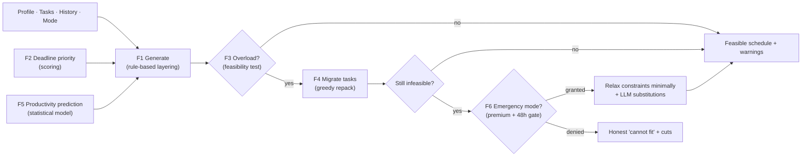

# AI Scheduling Engine — Design Specification

**Document type:** AI/Algorithm engineering design
**Author:** Senior AI Engineer
**Version:** 1.0
**Scope:** A hybrid scheduling engine = rule-based constraint solving + priority scoring + LLM (Claude) recommendations. The LLM advises; it never decides feasibility.

---

## 0. Foundations (shared by all features)

**Time model.** The planning horizon is `H` days. Each day is discretized into fixed slots of size `Δ` (default 15 min), so a day has `D = 1440/Δ = 96` slots and the timeline has `S = H·D` slots. Working in integer slots makes overlap checks and capacity math exact and O(1) per slot.

**Constraint classes.**
- **Hard (never violated in standard mode):** sleep ≥ 6h; required meals present; required exercise present; every task allocation completes before its deadline; no two blocks overlap.
- **Soft (optimized via a cost/score):** user preferences (preferred meal/exercise times, buffers), productivity-hour alignment, activity-type placement.

**Notation used in complexity analysis:** `n` = tasks, `H` = horizon days, `D` = slots/day, `S = H·D`, `B` = productivity buckets (24 hourly, or 24×7), `M` = historical completion records.

**Engine pipeline.**



**Where the LLM is allowed:** natural-language task parsing, substitution suggestions (F6), and turning solver decisions into human explanations. Every LLM output is schema-validated and treated as a *preference or suggestion* fed back into the deterministic solver — never as the authority on feasibility, sleep, or deadlines. If the LLM is unavailable, a rules-based fallback covers all of these.

---

## 1. Schedule Generation

**Algorithm.** Layered constraint placement: (1) lay immovable fixed blocks, (2) lay protected health blocks, (3) compute remaining free intervals, (4) place tasks into free intervals in priority order (F2), preferring predicted-productive windows (F5), splitting tasks across intervals when needed. Greedy with bounded backtracking when a placement fails. This is interval scheduling over a discretized timeline rather than a general (NP-hard) job-shop solve — the layering and the small realistic problem size keep it tractable and fast.

**Inputs.** `UserProfile` (sleep/meal/exercise targets, work blocks, preferences), task list `T`, productivity windows from F5, `mode`, horizon `H`.

**Outputs.** A set of non-overlapping `ScheduleBlock`s covering the horizon, a feasibility flag, and a list of warnings (e.g., "sleep at floor", "task X at risk").

**Pseudocode.**
```text
function generateSchedule(profile, tasks, prediction, mode, H):
    timeline = emptyTimeline(H, D)            # all slots free

    # 1. Hard fixed blocks
    for block in profile.workBlocks expanded over H:
        timeline.reserve(block, FIXED)

    # 2. Protected health blocks (hard)
    for day in 1..H:
        place(timeline, day, SLEEP,   minSleep=6h, prefer=profile.sleepWindow)
        for m in profile.meals:  place(timeline, day, MEAL, m.time, tolerance)
        if profile.exerciseEnabled: place(timeline, day, EXERCISE, prefer=...)
    if any health placement failed: warn(); attempt relaxation of SOFT only

    # 3. Free intervals
    free = timeline.freeIntervals()           # sorted list of (start,end)

    # 4. Tasks in priority order (F2), best-window-first (F5)
    queue = prioritize(tasks)                 # see Feature 2
    for task in queue:
        need = task.remainingMinutes
        for slot in rankSlots(free, prediction):   # productive windows first
            if need == 0: break
            take = min(slot.capacity, need, task.maxChunk)
            if take >= MIN_CHUNK and slot.end <= task.deadline:
                assign(task, slot, take); need -= take; free.update(slot)
        if need > 0: markAtRisk(task)          # feeds Overload Detection (F3)

    return { blocks: timeline.blocks(), atRisk: [...], warnings: [...] }
```

**Complexity.** Laying fixed + health blocks: `O(H·D)`. Prioritizing tasks: `O(n log n)`. Placement: each task scans candidate free intervals; with a sorted/interval-tree structure this is `O(n log F)` (F = free-interval count ≤ S). **Total: `O(H·D + n log n + n log S)`** — effectively linear-ithmic for realistic sizes (`n ≤ ~30`, `H ≤ ~30`), comfortably inside the 2s p95 target.

---

## 2. Deadline Prioritization

**Algorithm.** A composite **priority score** per task drives a max-heap. The score blends three normalized signals: *urgency* (demand density against the deadline), *importance* (user priority), and *slack pressure* (how little buffer remains). The base ordering is Earliest-Deadline-First (provably optimal for meeting deadlines when feasible); the score refines ties and injects user priority.

**Inputs.** Tasks with `remainingMinutes`, `deadline` (nullable), `priority`; current time `now`; tunable weights `w1..w3`.

**Outputs.** A priority-ordered task queue (and the numeric score per task, surfaced for explanations).

**Pseudocode.**
```text
PRIORITY_WEIGHT = {LOW:1, MEDIUM:2, HIGH:4, URGENT:8}

function score(task, now):
    if task.deadline == null:
        urgency = 0.1                          # opportunistic, never blocks health
        slackTerm = 0
    else:
        timeLeft = minutes(task.deadline - now)
        urgency  = task.remainingMinutes / max(timeLeft, Δ)   # >1 ⇒ impossible alone
        slack    = timeLeft - task.remainingMinutes
        slackTerm = 1 / (1 + max(slack, 0)/HORIZON_MINUTES)   # ↑ as slack ↓
    imp = PRIORITY_WEIGHT[task.priority] / 8                  # normalize 0..1
    return w1*clamp(urgency,0,1) + w2*imp + w3*slackTerm

function prioritize(tasks):
    heap = maxHeap()
    for t in tasks: heap.push(t, score(t, now))
    return heap.drainSorted()                  # highest score first
```

**Complexity.** Scoring is `O(1)` per task → `O(n)`; building/draining the heap is `O(n log n)`. **Total: `O(n log n)`.**

---

## 3. Overload Detection

**Algorithm.** An exact feasibility test based on the **processor-demand criterion** (the EDF schedulability test). Walk the timeline in deadline order: at every deadline `d`, the cumulative task demand that *must* be done by `d` may not exceed the cumulative free capacity available before `d`. If demand ever exceeds supply, the schedule is infeasible and the overflow amount is the gap. This is exact, not heuristic — no false "it fits" answers.

**Inputs.** Per-interval free capacity (from F1), tasks with `remainingMinutes` + `deadline`.

**Outputs.** `isOverloaded` flag, total overflow minutes, the deadline window(s) where it breaks, and the set of at-risk/infeasible tasks.

**Pseudocode.**
```text
function detectOverload(tasks, freeCapacityByTime):
    deadlines = sorted(unique(t.deadline for t in tasks if t.deadline))
    overflow = 0; breaks = []
    for d in deadlines:
        demand = sum(t.remainingMinutes for t in tasks
                     if t.deadline != null and t.deadline <= d)
        supply = freeCapacityBefore(d, freeCapacityByTime)   # prefix sum
        if demand > supply:
            overflow = max(overflow, demand - supply)
            breaks.append({ deadline: d, gap: demand - supply })
    return { isOverloaded: overflow > 0, overflow, breaks }
```

**Complexity.** Sort deadlines `O(n log n)`; prefix-sum capacity once `O(S)`; sweep with the prefix array `O(n)`. **Total: `O(n log n + S)`.**

---

## 4. Automatic Task Migration

**Algorithm.** A greedy **repack** that resolves overload by moving the *cheapest-to-defer* tasks to future free capacity until the feasibility test (F3) passes. Migration cost is the inverse of urgency: low-priority tasks with distant or no deadlines move first; urgent near-deadline tasks stay put. It's a load-balancing/bin-repacking pass across days that always re-validates against deadlines, so a migration can never push a task past its deadline. Residual infeasibility after exhausting future capacity is reported (→ honest message or F6).

**Inputs.** Current allocation, overload result (F3), tasks, per-day future free capacity.

**Outputs.** Updated allocation, ordered list of migrated tasks with reasons, residual overflow (0 if resolved).

**Pseudocode.**
```text
function migrate(allocation, overload, tasks, futureCapacity):
    movers = tasks
        .filter(t -> t.deadline == null or not t.isUrgent)
        .sortBy(migrationCost ascending)      # cost = score(t) from F2
    moved = []
    for t in movers:
        if not stillOverloaded(allocation): break
        target = earliestDayWithCapacity(futureCapacity, t.remainingMinutes,
                                         beforeDeadline = t.deadline)
        if target != null:
            relocate(t, target, allocation); futureCapacity.update(target)
            moved.append({ task: t, to: target, reason: "load balancing" })
    residual = detectOverload(currentTasks(allocation), capacityOf(allocation))
    return { allocation, moved, residual: residual.overflow }
```

**Complexity.** Rank movers `O(n log n)`. Each move finds a target day; with a per-day capacity heap that's `O(log H)`, over ≤ n moves → `O(n log H)`. Re-validation `O(n log n + S)`. **Total: `O(n log n + n log H + S)`.**

---

## 5. Productivity Prediction

**Algorithm.** A transparent **statistical model**, not an LLM. Historical completions are bucketed by time-of-day (and optionally weekday). Each bucket's success rate is estimated with **recency-weighted Beta-Binomial smoothing**: observed completions are shrunk toward a population prior via pseudo-counts, which solves cold start (a new user starts at the prior with low confidence) and stabilizes small samples. Recent data is weighted more via an exponential half-life. Tomorrow's predicted productive windows = top-ranked buckets by smoothed rate, with confidence from effective sample size. (An LLM may *describe* the result in plain language, but never computes it.)

**Inputs.** `CompletionLog` history (or pre-aggregated `ProductivityProfile`), target date, population prior `(α₀, β₀)`, half-life `λ`.

**Outputs.** Ranked windows `[{start, end, score, confidence}]`, plus a `modelVersion`.

**Pseudocode.**
```text
function predict(history, targetDate, prior=(α0,β0), halfLife):
    for bucket b in 0..B-1:
        wDone = wSched = 0
        for rec in history[b]:
            w = 0.5 ** (ageInDays(rec) / halfLife)      # recency weight
            wSched += w
            wDone  += w * (rec.status == COMPLETED ? 1 : 0)
        # Beta-Binomial posterior mean (smoothed toward prior)
        rate[b]       = (α0 + wDone) / (α0 + β0 + wSched)
        confidence[b] = wSched / (wSched + (α0 + β0))    # 0..1, ↑ with data
        scoreB[b]     = rate[b] * (0.5 + 0.5*confidence[b])
    windows = mergeAdjacent(topK(scoreB))                # contiguous peaks
    return windows.sortByScoreDesc()
```

**Complexity.** Aggregation over history `O(M)` (or `O(B)` if pre-rolled into `ProductivityProfile`). Scoring + ranking buckets `O(B log B)`, `B` ≤ 168. **Total: `O(M + B log B)`** for a refresh; `O(B log B)` per prediction when buckets are precomputed. Designed to run as a nightly batch job, so it's off the request path entirely.

---

## 6. Premium Emergency Mode

**Algorithm.** Controlled **constraint relaxation** under explicit consent and rationing. Instead of failing when F4 leaves residual overflow, emergency mode re-runs generation with a relaxed hard-constraint set governed by a penalty function so it relaxes *as little as necessary* (Lagrangian-style soft penalties): allow sleep below 6h down to an absolute safety floor (e.g., 4h — never lower), permit task placement inside work/study blocks, and request **LLM substitution suggestions** (cooking → delivery, gym → short cardio) to reclaim minutes before cutting sleep. Gated by: premium entitlement **and** the once-per-48h `OverloadEvent` rule. The output is explicit about every relaxation and accrues "health debt" surfaced to the user.

**Inputs.** Residual infeasibility (F4), `user.entitlement`, last `OverloadEvent` timestamp, profile, LLM client.

**Outputs.** A relaxed schedule with itemized warnings and health-debt accounting; **or** a denial (`reason: ENTITLEMENT | RATIONED`) with the honest fallback.

**Pseudocode.**
```text
function emergencyMode(ctx, user, lastOverload, llm):
    if not user.isPremium:           return deny("ENTITLEMENT")
    if hoursSince(lastOverload) < 48: return deny("RATIONED")

    # 1. Reclaim time WITHOUT cutting sleep first (LLM advises, we validate)
    subs = llm.suggestSubstitutions(ctx)        # JSON, schema-validated
    subs = filterValid(subs)                    # reject anything unsafe/garbled
    applyReclaimed(ctx, subs)                    # e.g. cooking→delivery frees 45m

    # 2. Re-test; only if still infeasible, relax sleep minimally
    relax = { minSleep: 6h }
    while infeasible(ctx, relax) and relax.minSleep > SAFETY_FLOOR(4h):
        relax.minSleep -= 15min
    if infeasible(ctx, relax): relax.allowTasksInWorkBlocks = true

    schedule = generateSchedule(ctx.profile, ctx.tasks, ctx.prediction,
                                EMERGENCY, ctx.H, overrides=relax)
    record(OverloadEvent, user, EMERGENCY)
    healthDebt = computeDebt(relax, subs)        # e.g. "-1.5h sleep, gym→cardio"
    return { schedule, relaxations: relax, substitutions: subs, healthDebt }
```

**Complexity.** Dominated by the re-generation `O(H·D + n log n + n log S)`; the minimal-relaxation loop adds an `O(k)` factor (`k` = relaxation steps, bounded by `(6h−4h)/15min = 8`); the LLM call is one network round-trip `O(1)` and is non-blocking-capable. **Total: `O(k·(H·D + n log n + n log S))` with small constant `k`.**

---

## Complexity Summary

| Feature | Time complexity | Runs on |
|---------|-----------------|---------|
| 1. Schedule generation | `O(H·D + n log n + n log S)` | request (fast) |
| 2. Deadline prioritization | `O(n log n)` | request |
| 3. Overload detection | `O(n log n + S)` | request |
| 4. Task migration | `O(n log n + n log H + S)` | request |
| 5. Productivity prediction | `O(M + B log B)` refresh; `O(B log B)` predict | nightly batch |
| 6. Emergency mode | `O(k·(H·D + n log n + n log S))` + 1 LLM call | request (premium) |

`n` = tasks, `H` = horizon days, `D` = slots/day, `S = H·D`, `B` = buckets (≤168), `M` = history records.

---

## Hybrid Design Rationale (why not "just ask the LLM")

1. **Determinism & trust.** Feasibility, sleep protection, and deadline guarantees come from exact algorithms (EDF / processor-demand test) whose output is reproducible and auditable. An LLM can't *prove* a day is feasible; the solver can.
2. **Cost & latency.** The hot path is pure computation (milliseconds, no tokens). LLM calls are reserved for parsing, substitutions, and explanations — and are cacheable/batchable.
3. **Safety.** The sleep floor, the 48h ration, and the "relax minimally" penalty are hard-coded guardrails the LLM cannot override. LLM suggestions are schema-validated and re-checked against constraints before anything is applied.
4. **Graceful degradation.** If the LLM is down, every feature still works via rules-based fallbacks; only the natural-language polish is lost.

The LLM makes the engine *feel* smart and humane; the rule-based core makes it *correct*.

---

*End of AI Scheduling Engine Design v1.0.*
