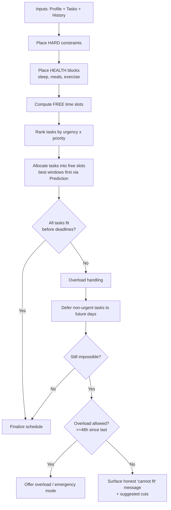

# Product Requirements Document — AI Healthy Scheduler

**Document type:** Product Requirements Document (PRD)
**Product:** AI Healthy Scheduler (web application)
**Version:** 1.0 (Draft)
**Owner:** Product Management
**Status:** For review

---

## 1. Product Vision

**Vision statement**
Most productivity apps optimize for output and quietly let health become the variable that gets cut — sleep, meals, and movement are the first things people sacrifice under a deadline. AI Healthy Scheduler inverts that default. It is a planning assistant that treats sleep, nutrition, and exercise as *protected, non-negotiable constraints* and fits work, study, and tasks around them — automatically generating a realistic daily schedule that gets things done **without** quietly destroying the user's wellbeing.

**Mission**
Help people meet their goals and deadlines while preserving a baseline healthy lifestyle, by using AI to allocate time intelligently, detect overload before it happens, and learn each user's real productivity patterns over time.

**Positioning (one line)**
*"A to-do list tells you what to do. A calendar tells you when you're busy. AI Healthy Scheduler tells you how to fit your life into your day without burning out."*

**Strategic pillars**
1. **Health-first scheduling** — wellbeing constraints are defaults, not afterthoughts.
2. **Realism over optimism** — the app refuses to generate schedules that are physically impossible and is honest when something won't fit.
3. **Personalization through learning** — the schedule improves as it learns when the user actually performs best.
4. **Gentle guardrails** — the app warns and rebalances rather than silently overcommitting, and rations "unhealthy" overload modes.

**Success metrics (North Star + supporting)**
- **North Star:** % of scheduled health blocks (sleep / meals / exercise) actually completed per week.
- 7-day and 30-day retention.
- Average nights/week with ≥ 6 hours of scheduled sleep.
- Task on-time completion rate (tasks finished before deadline).
- Premium conversion rate.
- Frequency of overload-mode usage (lower is healthier; tracked as a guardrail metric).

---

## 2. User Personas

### Persona 1 — Minh, "The Overwhelmed Student" (Primary)
- **Age / context:** 20, full-time university student, part-time barista 3 evenings/week.
- **Goals:** Pass exams, hit assignment deadlines, still have a social life.
- **Pain points:** Pulls all-nighters before deadlines, skips meals, irregular sleep, underestimates how long tasks take.
- **Needs from product:** Automatic allocation of study time across days, deadline safety, a nudge before sleep collapses.
- **Tech comfort:** High. Mobile-first.

### Persona 2 — Sarah, "The Burnt-out Knowledge Worker" (Primary)
- **Age / context:** 32, remote product manager, fixed 9–6 work block full of meetings.
- **Goals:** Protect focus time, stop working through lunch, get back to the gym.
- **Pain points:** Back-to-back meetings, no buffer, eats at her desk, exercises "when there's time" (never).
- **Needs from product:** Respect for fixed work blocks, protected meal/exercise slots, realistic free-time detection.
- **Tech comfort:** High. Desktop-first, calendar-integrated.

### Persona 3 — David, "The Optimizer" (Secondary)
- **Age / context:** 28, software engineer and amateur athlete.
- **Goals:** Maximize deep-work output while protecting a strict training schedule.
- **Pain points:** Wants data on when he's actually most productive; dislikes vague advice.
- **Needs from product:** Analytics, productivity prediction, fine-grained customization.
- **Tech comfort:** Very high. Power user, likely premium.

### Persona 4 — Lan, "The Freelancer with No Structure" (Secondary)
- **Age / context:** 35, freelance designer, irregular client deadlines, no fixed work hours.
- **Goals:** Impose structure on chaotic days, avoid feast-or-famine work patterns.
- **Pain points:** Variable workload, blurred work/life boundaries, easily overloaded.
- **Needs from product:** Flexible blocks, overload detection, task rebalancing across days.
- **Tech comfort:** Medium-high.

---

## 3. User Stories

Stories are grouped by epic. Each maps to functional requirements in §4. Format: *As a [persona], I want [capability], so that [outcome].*

### Epic A — Daily Schedule Generation
- **A1.** As a student, I want the app to generate a full daily schedule from my profile, so that I don't have to plan my day manually.
- **A2.** As a worker, I want my fixed work hours respected as immovable, so that the schedule fits around reality.
- **A3.** As a user, I want sleep, meals, and exercise auto-included every day, so that health is never skipped by default.
- **A4.** As a user, I want to toggle optional activities (cooking, entertainment, commuting, social), so that my schedule reflects my actual lifestyle.
- *Acceptance:* Generating a schedule for a valid profile always produces sleep + ≥2 meal blocks + (if enabled) one exercise block, with no overlapping blocks.

### Epic B — Task & Deadline Management
- **B1.** As a user, I want to add a task with title, estimated duration, deadline, and description, so that the AI can plan it in.
- **B2.** As a student, I want tasks automatically placed into free time slots before their deadline, so that I finish on time.
- **B3.** As a user, I want a large task split across multiple days if it doesn't fit in one, so that long projects are manageable.
- *Acceptance:* A task with a valid future deadline is allocated to free slots totaling ≥ its estimated duration, all before the deadline, or the user is explicitly told it cannot fit (see Epic D).

### Epic C — Healthy Balance System
- **C1.** As a user, I want health blocks protected even on busy days, so that I don't sacrifice wellbeing for work.
- **C2.** As a user, I want a clear warning when my scheduled sleep drops below 6 hours, so that I can make an informed choice.
- **C3.** As a user, I want tasks rebalanced rather than crammed when workload is high, so that the day stays survivable.
- *Acceptance:* Scheduled sleep < 6h triggers a visible warning; the scheduler will not auto-generate < 6h sleep unless emergency mode (premium) is explicitly enabled.

### Epic D — Overload Detection
- **D1.** As a freelancer, I want to be told when my schedule is impossible, so that I'm not set up to fail.
- **D2.** As a user, I want non-urgent tasks auto-moved to future days when today is full, so that today stays realistic.
- **D3.** As a user, I want overload mode limited to once every 2 days, so that "just this once" doesn't become a habit.
- *Acceptance:* When required task time exceeds available healthy capacity, the system rebalances first; overload mode is selectable only if ≥ 2 days have passed since the last overload day.

### Epic E — Daily Checklist
- **E1.** As a user, I want to check off completed activities, so that I can track my day.
- **E2.** As a user, I want completion data to feed analytics and predictions, so that the app gets smarter.

### Epic F — Analytics
- **F1.** As an optimizer, I want daily/weekly/monthly charts of my activities, so that I can see patterns.
- **F2.** As a user, I want productivity statistics (completion rate, health-block adherence), so that I can improve.

### Epic G — Productivity Prediction
- **G1.** As an optimizer, I want tomorrow's most productive periods predicted from my history, so that hard tasks land at my best times.

### Epic H — Premium
- **H1.** As a premium user, I want an emergency mode that permits < 6h sleep, so that I can handle true crunch periods knowingly.
- **H2.** As a premium user, I want the option to run tasks inside work/study blocks, so that I can borrow time when desperate.
- **H3.** As a premium user, I want healthy substitutions suggested (cooking → delivery, gym → light cardio), so that I save time without fully dropping health.

---

## 4. Functional Requirements

Each requirement is uniquely IDed (FR-x) with priority: **P0** (MVP-critical), **P1** (important), **P2** (nice-to-have).

### Schedule Generation
- **FR-1 (P0):** The system shall generate a 24-hour daily schedule from the user profile, composed of non-overlapping time blocks.
- **FR-2 (P0):** Every generated day shall include sleep, at least two meal blocks, and (if enabled) one exercise block by default.
- **FR-3 (P0):** The system shall treat user-defined fixed blocks (work/study hours) as immovable hard constraints.
- **FR-4 (P1):** The system shall allow the user to enable/disable and configure optional activities: cooking, entertainment, commuting, social.
- **FR-5 (P1):** The system shall regenerate the schedule on demand and when tasks/profile change.

### Tasks & Deadlines
- **FR-6 (P0):** The system shall let users create, edit, and delete tasks with title, estimated duration, deadline, and description.
- **FR-7 (P0):** The system shall allocate tasks into available free slots such that total allocated time ≥ estimated duration and all allocations occur before the deadline.
- **FR-8 (P1):** The system shall split a task across multiple days/slots when it cannot fit in a single contiguous slot.
- **FR-9 (P1):** The system shall order task placement by urgency (deadline proximity) and user-set priority.

### Healthy Balance
- **FR-10 (P0):** The system shall enforce a configurable minimum sleep duration (default 6h) as a soft-blocking constraint in standard mode.
- **FR-11 (P0):** The system shall display a prominent warning whenever scheduled sleep < 6h.
- **FR-12 (P1):** When workload exceeds capacity, the system shall rebalance tasks across days before reducing health blocks.

### Overload Detection
- **FR-13 (P0):** The system shall detect when required task time exceeds available healthy capacity for a day and flag the day as overloaded.
- **FR-14 (P0):** The system shall automatically defer non-urgent tasks (those with later or no hard deadline) to future days when a day is overloaded.
- **FR-15 (P0):** The system shall permit explicit "overload mode" for a day at most once per rolling 48-hour window.
- **FR-16 (P1):** The system shall tell the user clearly which tasks were moved and why.

### Checklist
- **FR-17 (P0):** The system shall let users mark any scheduled block as completed, skipped, or partially done.
- **FR-18 (P0):** The system shall persist completion data per block with timestamps.

### Analytics
- **FR-19 (P1):** The system shall present daily, weekly, and monthly charts of time spent / completed per activity category.
- **FR-20 (P1):** The system shall compute productivity statistics: task completion rate, on-time rate, and health-block adherence.

### Prediction
- **FR-21 (P2):** The system shall predict the next day's highest-productivity time windows using historical completion data and surface them in scheduling.

### Premium
- **FR-22 (P1):** The system shall offer a premium tier gating: emergency mode (sleep < 6h allowed), tasks-inside-work-blocks, and substitution suggestions.
- **FR-23 (P1):** The system shall suggest substitutions when time is short (cooking → food delivery; gym → light home cardio; configurable activity swaps).
- **FR-24 (P0):** The system shall enforce entitlement checks so premium features are inaccessible to free users.

---

## 5. Non-Functional Requirements

- **NFR-1 — Performance:** A schedule for a single day shall generate in ≤ 2 seconds (p95) for a typical load (≤ 30 tasks, 7-day horizon).
- **NFR-2 — Scalability:** Architecture shall support horizontal scaling of the scheduling service; target 100k MAU without redesign.
- **NFR-3 — Availability:** 99.5% monthly uptime for the core scheduling and checklist services.
- **NFR-4 — Security:** All data encrypted in transit (TLS 1.2+) and at rest. Authentication via industry-standard (OAuth 2.0 / OIDC), passwords hashed (bcrypt/argon2).
- **NFR-5 — Privacy & Compliance:** Schedule/health-adjacent data is sensitive. Comply with GDPR (and regional equivalents): explicit consent, data export, right to deletion, data minimization. Do **not** classify as clinical/medical data, but treat with elevated care; surface a clear disclaimer that the app is **not** a medical device and does not give medical advice.
- **NFR-6 — Usability:** A new user shall be able to generate their first schedule within 3 minutes of signup (guided onboarding).
- **NFR-7 — Accessibility:** WCAG 2.1 AA compliance — keyboard navigation, screen-reader labels, color-contrast-safe charts (never color alone to convey meaning).
- **NFR-8 — Responsiveness:** Fully responsive web app; mobile-first layouts for the daily view and checklist.
- **NFR-9 — Internationalization:** Support multiple timezones and 24h/12h formats from day one; architecture ready for localized strings.
- **NFR-10 — Reliability of scheduling:** The scheduler must be deterministic given identical inputs (reproducible), and must never produce overlapping blocks or schedule a fixed block over another fixed block.
- **NFR-11 — Observability:** Structured logging, metrics, and tracing on the scheduling pipeline; alerting on generation failures and latency breaches.

---

## 6. Database Entities

Conceptual data model (relational baseline; can map to PostgreSQL). Key fields shown; `id`, `created_at`, `updated_at` assumed on all.

**User**
`id`, `email`, `password_hash`, `timezone`, `subscription_tier` (free/premium), `locale`.

**UserProfile** (1:1 with User)
`user_id` (FK), `wake_time`, `sleep_time`, `target_sleep_hours` (default 6), `meal_count`, `meal_times[]`, `exercise_enabled`, `exercise_duration`, `work_blocks[]` (fixed start/end, days of week), `enabled_optional_activities[]` (cooking/entertainment/commute/social), `commute_duration`.

**Task**
`id`, `user_id` (FK), `title`, `description`, `estimated_minutes`, `deadline` (datetime, nullable), `priority` (low/med/high), `status` (pending/scheduled/in_progress/done/deferred), `is_splittable` (bool), `remaining_minutes`.

**DailySchedule**
`id`, `user_id` (FK), `date`, `mode` (standard/overload/emergency), `is_overloaded` (bool), `generation_meta` (JSON: version, inputs hash), `total_sleep_minutes`.

**ScheduleBlock** (belongs to DailySchedule)
`id`, `schedule_id` (FK), `activity_type` (enum: sleep/meal/exercise/work/study/cooking/entertainment/commute/social/task/buffer), `task_id` (FK, nullable — set when block is a task allocation), `start_time`, `end_time`, `is_fixed` (bool), `is_health_block` (bool).

**CompletionLog**
`id`, `block_id` (FK), `user_id` (FK), `status` (completed/skipped/partial), `actual_minutes`, `completed_at`.

**OverloadEvent**
`id`, `user_id` (FK), `date`, `triggered_at`, `mode` (overload/emergency) — used to enforce the once-per-48h rule.

**ProductivityProfile** (derived/aggregated)
`id`, `user_id` (FK), `time_window` (e.g., hour-of-day bucket or part-of-day), `completion_rate`, `sample_size`, `last_updated`.

**Prediction**
`id`, `user_id` (FK), `target_date`, `predicted_windows[]` (ranked time ranges with confidence), `model_version`, `generated_at`.

**Subscription**
`id`, `user_id` (FK), `tier`, `status`, `started_at`, `renews_at`, `provider_ref`.

**Key relationships**
- User 1—1 UserProfile; User 1—* Task; User 1—* DailySchedule.
- DailySchedule 1—* ScheduleBlock; ScheduleBlock 0..1—1 Task (a task may span multiple blocks).
- ScheduleBlock 1—* CompletionLog (typically 1); CompletionLog aggregates into ProductivityProfile, which feeds Prediction.

---

## 7. AI Scheduling Logic

The scheduler is best modeled as a **constraint-satisfaction + priority-optimization** problem, with a lightweight **ML layer** for productivity prediction. It is **not** a generative free-text task — determinism and correctness matter more than creativity.

### 7.1 Pipeline overview

### 7.2 Constraint hierarchy
1. **Hard constraints (never violated in standard mode):**
   - Fixed work/study blocks.
   - No two blocks overlap.
   - Sleep ≥ minimum (default 6h).
   - A task allocation must end before its deadline.
2. **Soft constraints (optimized, can flex):**
   - Place exercise; honor preferred meal times within a tolerance window.
   - Prefer placing demanding tasks in predicted high-productivity windows.
   - Honor optional activities when room allows.
   - Maintain buffer time between blocks.

### 7.3 Allocation algorithm (standard mode)
1. Lay down hard constraints (work/study) on the timeline.
2. Lay down health blocks (sleep anchored to profile; meals near preferred times; exercise).
3. Compute remaining **free slots**.
4. Build a task queue scored by `urgency × priority`, where `urgency = f(time_until_deadline, remaining_minutes)`. Earliest-deadline-first as the base heuristic.
5. For each task, allocate into free slots — preferring slots overlapping predicted high-productivity windows (§7.5). Split across slots/days if `is_splittable`.
6. If a task cannot be fully placed before its deadline → mark the day a candidate for **overload handling**.

### 7.4 Healthy balance & overload handling
- **Rebalance first:** when the day exceeds healthy capacity, defer **non-urgent** tasks (no near deadline / lower priority) to subsequent days before touching health blocks.
- **Warn, don't silently cut:** if sleep would drop below the minimum, the standard scheduler refuses and warns; reducing sleep is only possible via premium **emergency mode**, chosen explicitly.
- **Overload rationing:** "overload mode" (and "emergency mode") may be activated at most once per rolling 48h window, enforced via `OverloadEvent`. If the limit is hit, the app gives an honest "this doesn't fit — here's what to drop/move" response instead.
- **Substitutions (premium):** when time is tight, suggest swaps that preserve partial health value (cooking → delivery to reclaim ~45 min; gym session → 15-min home cardio) rather than deleting the block entirely.

### 7.5 Productivity prediction (ML layer)
- **Goal:** predict tomorrow's highest-completion time windows per user.
- **Cold start:** with little/no history, fall back to population priors (e.g., late-morning and early-evening focus peaks) and the user's stated preferences. Confidence is reported as low.
- **Data:** `CompletionLog` aggregated into `ProductivityProfile` (completion rate by hour-of-day / part-of-day, optionally by activity type and weekday).
- **Model:** start simple and explainable — a weighted moving average / logistic model over time-of-day buckets, with recency weighting. Evolve to a per-user gradient-boosted or sequence model once data volume justifies it. Determinism and explainability are favored early.
- **Output:** ranked `predicted_windows[]` with confidence, consumed in step 5 of allocation to place demanding tasks well.
- **Guardrail:** prediction influences *placement preference* only — it never overrides hard constraints or health protections.

---

## 8. Edge Cases

| # | Scenario | Expected behavior |
|---|----------|-------------------|
| 1 | Deadline already in the past | Reject on input with validation; offer to set a new deadline or mark as overdue. |
| 2 | Single task longer than any available slot and not splittable | Warn it can't fit; suggest splitting, extending the horizon, or trimming scope. |
| 3 | Total task time exceeds all free time before deadlines | Rebalance → defer non-urgent → if still impossible, honest "cannot fit" with suggested cuts. |
| 4 | Sleep spans midnight (e.g., 23:30–07:30) | Handle as a cross-day block; attribute correctly to the night and compute total sleep right. |
| 5 | User changes timezone / DST shift | Recompute against the user's current timezone; preserve wall-clock intent of fixed blocks; avoid double-counting/skipping the DST hour. |
| 6 | No historical data (new user) | Use population priors + stated preferences for prediction; label confidence low; never block scheduling. |
| 7 | Overlapping fixed blocks defined by user | Detect conflict at profile-save time; require resolution before generation. |
| 8 | Overload requested but < 48h since last overload | Deny; explain the 48h rule; offer rebalance/defer alternatives. |
| 9 | All free time consumed by fixed blocks | Health blocks still protected; tasks fully deferred; warn the day has no task capacity. |
| 10 | Task with no deadline | Treat as low urgency; schedule opportunistically in free time; never blocks health. |
| 11 | User marks far more / fewer actual minutes than estimated | Update `remaining_minutes`; feed actuals into productivity profile; re-plan remainder. |
| 12 | Free user attempts a premium feature | Block with entitlement check and upgrade prompt; never partially apply. |
| 13 | Concurrent edits / regeneration race | Use the latest inputs-hash; last write wins on the schedule, with optimistic locking on tasks. |
| 14 | Extremely long horizon / huge task list | Cap planning horizon (e.g., 14–30 days) and paginate; protect generation latency (NFR-1). |
| 15 | Generation failure / solver timeout | Fail gracefully: return last good schedule, surface a retry, log/alert (NFR-11). |

---

## 9. Future Roadmap

**Phase 0 — MVP (P0 features)**
Profile + onboarding, daily schedule generation with protected health blocks, task/deadline management with auto-allocation, < 6h sleep warning, overload detection with deferral + 48h rule, daily checklist. Web, responsive, single-timezone-aware.

**Phase 1 — Insight (P1)**
Analytics dashboard (daily/weekly/monthly), productivity statistics, task rebalancing polish, substitution suggestions, premium tier launch (emergency mode, tasks-in-work-blocks), calendar **read** integration (Google/Outlook) to import fixed blocks.

**Phase 2 — Intelligence (P2)**
Productivity prediction model (cold-start priors → per-user model), two-way calendar sync, smarter natural-language task entry, recurring tasks & routines, weekly planning view.

**Phase 3 — Ecosystem**
Wearable integration (sleep/HR/activity from Apple Health, Fitbit, Garmin) to ground health blocks in real data; native mobile apps; notifications & adaptive re-planning during the day; voice input.

**Phase 4 — Expansion**
Team / family shared scheduling; coaching insights and habit-streak systems; partner integrations for substitutions (food delivery, fitness apps); export/API for power users; experimentation with energy-based scheduling (matching task type to predicted energy state).

**Explicitly out of scope (for now):** clinical/medical advice, diagnosis, calorie/nutrition tracking as a medical tool. The product is a planning aid, not a health authority — reflected in onboarding disclaimers and NFR-5.

---

*End of PRD v1.0.*
